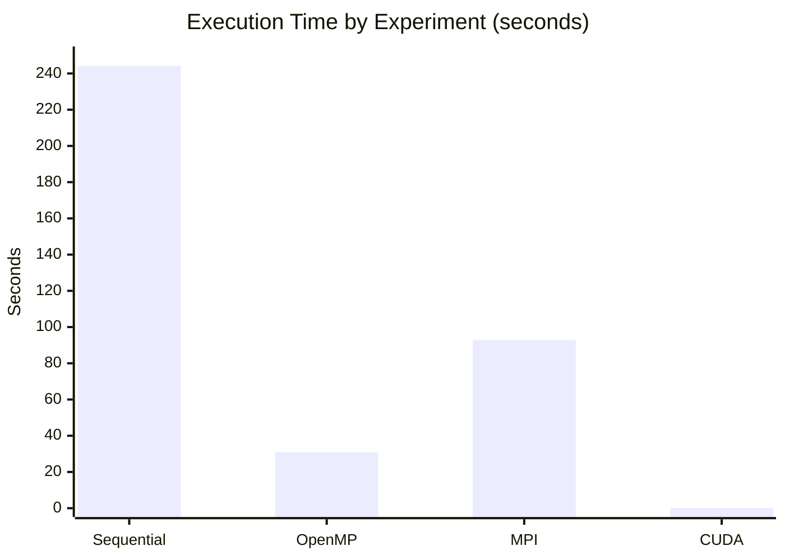
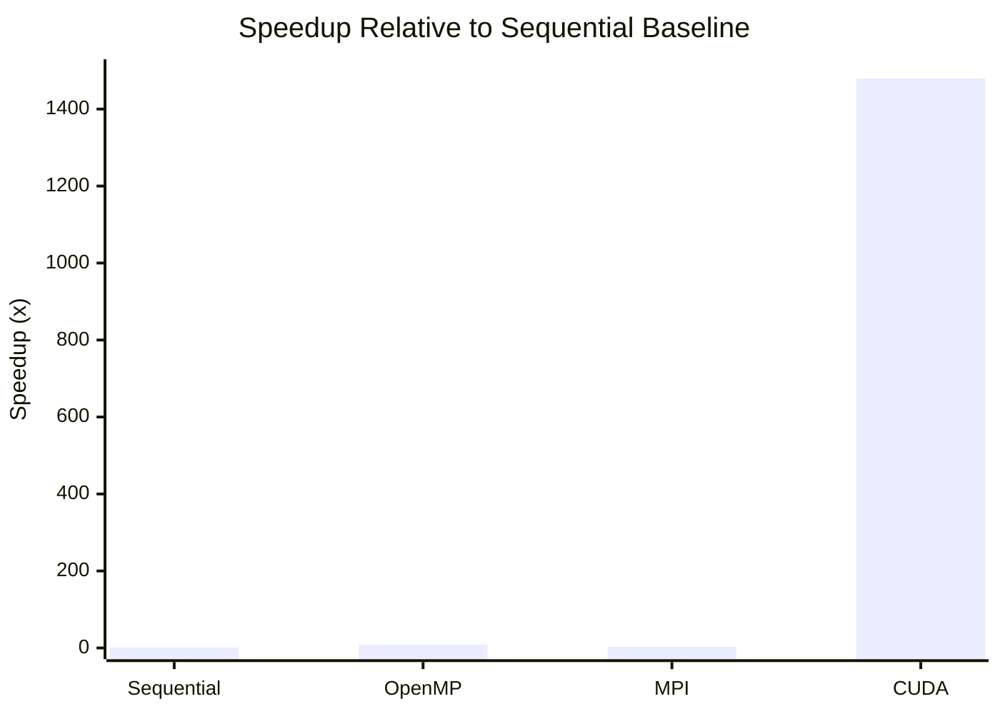

<div align="center">

# MATRIX MULTIPLICATION USING SEQUENTIAL, OPENMP, MPI AND CUDA

### A Comparative Performance Study of CPU, Shared-Memory, Distributed-Memory and GPU Computing

</div>

---

## Table of Contents

1. [Introduction](#1-introduction)
2. [Problem Definition](#2-problem-definition)
3. [Objectives](#3-objectives)
4. [Requirements and Tools](#4-requirements-and-tools)
5. [Experiment Overview](#5-experiment-overview)
6. [Experiment 1 — Sequential Matrix Multiplication](#6-experiment-1--sequential-matrix-multiplication)
7. [Experiment 2 — OpenMP Matrix Multiplication](#7-experiment-2--openmp-matrix-multiplication)
8. [Experiment 3 — MPI Distributed Matrix Multiplication](#8-experiment-3--mpi-distributed-matrix-multiplication)
9. [Experiment 4 — CUDA Matrix Multiplication](#9-experiment-4--cuda-matrix-multiplication)
10. [Results and Performance Comparison](#10-results-and-performance-comparison)
11. [Graphical Analysis](#11-graphical-analysis)
12. [Observations](#12-observations)
13. [Troubleshooting](#13-troubleshooting)
14. [Conclusion](#14-conclusion)

---

## 1. Introduction

This project implements the same **4000 × 4000 matrix multiplication** workload using four computing approaches: sequential CPU execution, OpenMP shared-memory parallelism, MPI distributed-memory parallelism, and CUDA GPU parallelism.

The sequential implementation establishes the baseline execution time. OpenMP then uses multiple CPU threads, MPI distributes work across four Ubuntu virtual machines, and CUDA offloads the calculation to an NVIDIA GPU. The experiments compare the recorded execution times and speedups while checking that each implementation produces the expected result.

**Recorded experiment environments**
- Sequential and OpenMP: Ubuntu running through WSL2 on a Windows host.
- MPI: Four Ubuntu virtual machines connected through a virtual network.
- CUDA: An NVIDIA RTX 4500 Ada Generation GPU with the CUDA environment.

## 2. Problem Definition

Let A and B be square matrices of size `N × N`, where `N = 4000`. All elements of A and B are initialized to `1.0`. The program calculates the product matrix C.

**Matrix multiplication formula**

\[
C[i][j] = \sum_{k=0}^{N-1} A[i][k] \times B[k][j]
\]

For this experiment, each output element is the sum of 4000 products of `1.0 × 1.0`. Therefore, the expected value is:

\[
C[i][j] = 4000.00
\]

The implementations verify the result by printing `C[0][0] = 4000.00`.

## 3. Objectives

- Implement matrix multiplication using a sequential CPU program.
- Parallelize the computation using OpenMP threads.
- Distribute matrix computation across multiple virtual machines using MPI.
- Implement GPU-based matrix multiplication using CUDA.
- Verify output correctness using the same expected result.
- Measure and compare execution time across all four experiments.
- Calculate speedup relative to the sequential baseline.
- Observe the impact of threading, distributed communication, and GPU parallelism.

## 4. Requirements and Tools

### Hardware

| Component | Requirement / recorded setup |
|---|---|
| Host system | Windows 10/11 |
| CPU and memory | Sufficient CPU cores and RAM for WSL2 and virtual machines |
| MPI environment | Four Ubuntu VMs: one Master and three Workers |
| GPU | NVIDIA CUDA-capable GPU; the recorded system uses RTX 4500 Ada Generation |

### Software and tools

| Tool | Purpose |
|---|---|
| Windows PowerShell | Verify WSL and launch Ubuntu |
| WSL2 and Ubuntu | Sequential and OpenMP execution environment |
| GCC / `build-essential` | Compile C source files |
| OpenMP | Parallel execution with CPU threads |
| VMware Workstation or equivalent | Run the MPI virtual-machine cluster |
| OpenSSH | Remote login between MPI nodes |
| Open MPI / `mpicc` | Compile and execute MPI programs |
| NVIDIA driver / `nvidia-smi` | Verify GPU availability |
| CUDA Toolkit / `nvcc` | Compile and execute CUDA programs |
| `htop` | Observe CPU utilization during OpenMP execution |

## 5. Experiment Overview

| Experiment | Computing model | Main configuration | Purpose |
|---|---|---|---|
| Experiment 1 | Sequential CPU | One execution flow | Establish the baseline |
| Experiment 2 | OpenMP shared memory | 8 CPU threads | Measure CPU multithreading |
| Experiment 3 | MPI distributed memory | 4 processes across 4 VMs | Measure distributed computation |
| Experiment 4 | CUDA GPU parallelism | NVIDIA RTX 4500 Ada; 16 × 16 threads per block | Measure GPU acceleration |

### Overall execution flow

flowchart TD
    A[Verify Environment] --> B[Experiment 1: Sequential CPU]
    B --> C[Experiment 2: OpenMP Threads]
    C --> D[Experiment 3: MPI Virtual Machine Cluster]
    D --> E[Experiment 4: CUDA GPU]
    E --> F["Verify Output: C of 0,0 equals 4000.00"]
    F --> G[Compare Execution Time and Speedup]flowchart TD
    A[Verify Environment] --> B[Experiment 1: Sequential CPU]
    B --> C[Experiment 2: OpenMP Threads]
    C --> D[Experiment 3: MPI Virtual Machine Cluster]
    D --> E[Experiment 4: CUDA GPU]
    E --> F["Verify Output: C of 0,0 equals 4000.00"]
    F --> G[Compare Execution Time and Speedup]
## 6. Experiment 1 — Sequential Matrix Multiplication

### Aim

To implement matrix multiplication using a single CPU execution flow and record the baseline execution time for comparison with the parallel implementations.

### Method

The program initializes matrices A and B with `1.0`, initializes C with `0.0`, and uses three nested loops to calculate the matrix product. The C program is compiled with GCC using the `-O2` optimization option.

### Setup, compilation and execution

Run the following commands inside the Ubuntu terminal in WSL2:

```bash
sudo apt update
sudo apt install build-essential -y
gcc -O2 matrix_sequential.c -o matrix_sequential
./matrix_sequential
```

**Source file:** `matrix_sequential.c`

### Recorded output

```text
Sequential Matrix Multiplication Completed
Matrix Size = 4000 x 4000
Execution Time = 244.120000 seconds
Verification C[0][0] = 4000.00
```

### Experiment 1 result

| Metric | Recorded result |
|---|---:|
| Matrix size | 4000 × 4000 |
| Computing model | Sequential CPU |
| Execution time | 244.120000 seconds |
| Verification | `C[0][0] = 4000.00` |
| Speedup | 1.00× (baseline) |

**Inference:** The sequential implementation establishes the reference time used to calculate speedup in Experiments 2, 3 and 4.

---

## 7. Experiment 2 — OpenMP Matrix Multiplication

### Aim

To parallelize matrix multiplication on a shared-memory CPU using OpenMP and compare its execution time with the sequential baseline.

### Method

OpenMP divides the outer loop among multiple CPU threads using the directive `#pragma omp parallel for`. The threads work on different output rows while sharing the matrices in memory. The recorded experiment uses eight threads.

### Setup, compilation and execution

Run inside Ubuntu on WSL2:

```bash
nproc
export OMP_NUM_THREADS=8
echo $OMP_NUM_THREADS
gcc -O2 -fopenmp matrix_openmp.c -o matrix_openmp
./matrix_openmp
```

**Source file:** `matrix_openmp.c`

The `-fopenmp` flag enables OpenMP support in GCC. The `htop` command can be used in a second terminal to observe CPU activity while the program is running.

### Recorded output

```text
OpenMP Matrix Multiplication Completed
Matrix Size = 4000 x 4000
Number of Threads Used = 8
Execution Time = 30.830434 seconds
Verification C[0][0] = 4000.00
```

### Experiment 2 result

| Metric | Recorded result |
|---|---:|
| Matrix size | 4000 × 4000 |
| Computing model | Shared-memory parallelism |
| CPU threads | 8 |
| Execution time | 30.830434 seconds |
| Verification | `C[0][0] = 4000.00` |
| Speedup over sequential | 7.92× |

**Inference:** OpenMP reduces execution time by allowing eight CPU threads to perform separate portions of the computation concurrently.

---

## 8. Experiment 3 — MPI Distributed Matrix Multiplication

### Aim

To implement matrix multiplication using MPI processes distributed across four Ubuntu virtual machines and study the effect of distributed computation and communication overhead.

### Method

The MPI setup consists of one Master VM and three Worker VMs. Matrix A is divided by rows among four MPI processes. Matrix B is broadcast to all processes. Each process calculates its assigned rows, and the partial results are gathered on rank 0.

### VM cluster configuration

| Node | Hostname | Reference IP address | MPI rank | Assigned rows |
|---|---|---|---:|---:|
| Master | `master` | `192.168.125.128` | 0 | 1000 |
| Worker 1 | `worker1` | `192.168.125.129` | 1 | 1000 |
| Worker 2 | `worker2` | `192.168.125.130` | 2 | 1000 |
| Worker 3 | `worker3` | `192.168.125.131` | 3 | 1000 |

The IP addresses are the reference values from the experiment and may differ if the virtual network assigns different addresses.

### Important MPI operations

| MPI operation | Explicit purpose in the experiment |
|---|---|
| `MPI_Init` | Initializes the MPI environment |
| `MPI_Comm_rank` | Identifies the current process rank |
| `MPI_Comm_size` | Determines the total number of MPI processes |
| `MPI_Scatter` | Distributes portions of matrix A to the processes |
| `MPI_Bcast` | Sends matrix B to all processes |
| `MPI_Gather` | Collects partial output rows on rank 0 |
| `MPI_Barrier` | Synchronizes processes at timing boundaries |
| `MPI_Finalize` | Ends the MPI environment |

### Setup, compilation and execution

Install SSH and MPI packages on every VM:

```bash
sudo apt update
sudo apt install openssh-server -y
sudo systemctl enable --now ssh
sudo apt install openmpi-bin libopenmpi-dev -y
```

From the Master VM, configure SSH access to the Workers and verify network connectivity. After preparing the `hosts` file and copying the executable to the Worker nodes, compile and launch the program:

```bash
mpicc -O2 matrix_mpi.c -o matrix_mpi
mpirun -np 4 --hostfile hosts sh -c '$HOME/matrix_mpi'
```

**Source file:** `matrix_mpi.c`

### Recorded output

```text
MPI Matrix Multiplication Completed
Matrix Size = 4000 x 4000
Number of MPI Processes = 4
Execution Time = 92.979510 seconds
Verification C[0][0] = 4000.00
```

### Experiment 3 result

| Metric | Recorded result |
|---|---:|
| Matrix size | 4000 × 4000 |
| Computing model | Distributed memory |
| MPI processes | 4 |
| Virtual machines | 4 |
| Rows per process | 1000 |
| Execution time | 92.979510 seconds |
| Verification | `C[0][0] = 4000.00` |
| Speedup over sequential | 2.63× |

**Inference:** MPI demonstrates distributed processing across multiple machines. Data distribution, result collection, process synchronization, and virtual-network communication contribute to the total execution time.

---

## 9. Experiment 4 — CUDA Matrix Multiplication

### Aim

To accelerate matrix multiplication using an NVIDIA GPU and measure both kernel execution time and total CUDA phase time.

### Method

The CPU initializes the matrices and allocates GPU memory. Matrices A and B are copied to the GPU, where a CUDA kernel computes output elements. The result matrix is copied back to host memory for verification.

Each CUDA thread calculates one output element, subject to the matrix bounds.

### CUDA execution configuration

| Parameter | Recorded configuration |
|---|---|
| Matrix size | 4000 × 4000 |
| Block dimensions | 16 × 16 |
| Threads per block | 256 |
| Grid dimensions | 250 × 250 blocks |
| Total blocks | 62,500 |
| Logical thread instances | 16,000,000 |
| GPU | NVIDIA RTX 4500 Ada Generation |

### Setup, compilation and execution

In a CUDA-capable terminal, verify the GPU and compiler, then compile and run:

```bash
nvidia-smi
nvcc --version
nvcc -O2 matrix_cuda.cu -o matrix_cuda
./matrix_cuda
```

**Source file:** `matrix_cuda.cu`

### Recorded output

```text
CUDA Matrix Multiplication Completed
Matrix Size = 4000 x 4000
Grid Size = 250 x 250 blocks
Block Size = 16 x 16 threads
Kernel Execution Time = 0.146443 seconds
Total CUDA Phase Time = 0.165004 seconds
Verification C[0][0] = 4000.00
```

### Experiment 4 result

| Metric | Recorded result |
|---|---:|
| Matrix size | 4000 × 4000 |
| GPU | NVIDIA RTX 4500 Ada Generation |
| Kernel execution time | 0.146443 seconds |
| Total CUDA phase time | 0.165004 seconds |
| Verification | `C[0][0] = 4000.00` |
| Speedup over sequential using total phase time | 1479.48× |

**Timing note:** Kernel execution time measures the kernel interval. Total CUDA phase time includes host-to-device transfer, kernel execution, and device-to-host transfer, as measured by the supplied program. The reported speedup uses total CUDA phase time.

---

## 10. Results and Performance Comparison

The following table consolidates the recorded results from all four experiments.

| Experiment | Implementation | Computing resources | Execution time | Speedup | Output verification |
|---|---|---|---:|---:|---|
| 1 | Sequential | Single CPU execution flow | 244.120000 s | 1.00× | `4000.00` |
| 2 | OpenMP | 8 CPU threads | 30.830434 s | 7.92× | `4000.00` |
| 3 | MPI | 4 processes across 4 VMs | 92.979510 s | 2.63× | `4000.00` |
| 4 | CUDA | NVIDIA RTX 4500 Ada Generation | 0.165004 s total phase | 1479.48× | `4000.00` |

### Speedup calculation

\[
\text{Speedup} = \frac{\text{Sequential execution time}}{\text{Execution time of the implementation}}
\]

For example, the OpenMP speedup is calculated using the recorded values:

\[
\frac{244.120000}{30.830434} \approx 7.92\times
\]

The same formula is applied to MPI and CUDA. The CUDA calculation uses the **total CUDA phase time** of `0.165004` seconds.

## 11. Graphical Analysis

### 11.1 Execution time comparison



| Experiment | Graph value |
|---|---:|
| Sequential | 244.120000 seconds |
| OpenMP | 30.830434 seconds |
| MPI | 92.979510 seconds |
| CUDA | 0.165004 seconds |

The graph compares the measured execution time for each implementation. Lower execution time indicates faster completion for this workload. CUDA has a much shorter recorded time, so the other bars are comparatively small on the same linear scale.

### 11.2 Speedup comparison



| Experiment | Speedup |
|---|---:|
| Sequential | 1.00× |
| OpenMP | 7.92× |
| MPI | 2.63× |
| CUDA | 1479.48× |

The graph shows each implementation's speedup relative to the sequential baseline. CUDA has the largest recorded speedup, followed by OpenMP and MPI.

**Note:** The charts are defined directly in this README, so this is a self-contained single-file README. GitHub renders Mermaid charts using its own chart styling; per-bar colors cannot be reliably set in GitHub Markdown.

## 12. Observations

| Experiment | Observation | Explanation |
|---|---|---|
| Sequential | Highest execution time among the CPU-based results | The computation follows one execution flow |
| OpenMP | Faster than sequential execution | Eight CPU threads execute different outer-loop iterations concurrently |
| MPI | Faster than sequential but slower than OpenMP in the recorded run | Processes distribute work across VMs, but communication and synchronization add overhead |
| CUDA | Lowest recorded total execution time | Many logical GPU threads compute output elements in parallel |
| All experiments | Same verification value | Each implementation reports `C[0][0] = 4000.00` |

The results represent the supplied experimental run. Actual timings can change with hardware, compiler optimization, virtualization settings, GPU configuration, and system load.

## 13. Troubleshooting

| Problem | Suggested solution |
|---|---|
| `wsl` command not found | In PowerShell, check `wsl --status` and `wsl -l -v`. |
| Ubuntu does not start | Run `wsl --shutdown`, then launch Ubuntu again. |
| `gcc` command not found | Run `sudo apt update` and `sudo apt install build-essential -y` inside Ubuntu. |
| OpenMP compilation fails | Ensure `-fopenmp` is included in the GCC command. |
| OpenMP uses fewer threads than expected | Check `nproc` and `echo $OMP_NUM_THREADS`; set the variable to `8` for the documented setup. |
| MPI ping fails | Verify the VM network and the current IP addresses. |
| SSH asks for a password | Run `ssh-copy-id` from the Master to each Worker and test remote hostname access. |
| MPI cannot launch Workers | Verify hostfile entries, passwordless SSH, and executable availability on each Worker. |
| `nvidia-smi` fails | Check that the NVIDIA driver is installed and the GPU is visible to the operating system. |
| `nvcc` command not found | Check the CUDA Toolkit installation and the `PATH` configuration. |

## 14. Conclusion

This project implements and compares matrix multiplication using sequential CPU execution, OpenMP shared-memory parallelism, MPI distributed-memory parallelism, and CUDA GPU parallelism. Each experiment performs the same `4000 × 4000` matrix multiplication and verifies the output using `C[0][0] = 4000.00`.

The recorded execution times are 244.120000 seconds for sequential execution, 30.830434 seconds for OpenMP, 92.979510 seconds for MPI, and 0.165004 seconds for the total CUDA phase. Based on these recorded values, the speedups are 1.00×, 7.92×, 2.63×, and 1479.48×, respectively.

The experiment highlights the trade-offs between single-flow execution, CPU threading, distributed communication, and GPU acceleration. For the documented workload and setup, CUDA produced the shortest measured execution time, while OpenMP improved performance using shared-memory CPU parallelism and MPI demonstrated computation distributed across multiple virtual machines.

---

**Reproducibility:** These are the recorded results in the lab document, not newly measured benchmarks. Run each program on the target environment to obtain fresh timings. Keep both graph image files in the same directory as this `README.md` so the images render correctly on GitHub.
